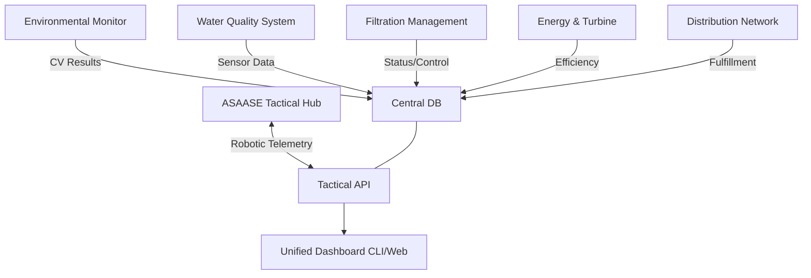

# ASAASE: Integrated Environmental Monitoring & Water Management Platform


## 🌍 Vision
The **ASAASE Platform** is a comprehensive software ecosystem designed for large-scale environmental protection and sustainable water management. Developed for the specific challenges of West African terrain, it combines computer vision, tactical robotics, and utility management into a single, unified command center.

---

## 🏗️ Integrated System Architecture

The software is composed of five specialized sub-systems that converge into the **Tactical Hub Dashboard**.



---

## 🧩 Core Software Modules

### 1. **Environmental Monitoring (`environmental_monitoring`)**
Detects environmental threats in real-time using high-speed computer vision.
- **Tree Cover Analysis**: Monitors deforestation via green-ratio variance.
- **Excavation Detection**: Identifies illegal mining or soil disturbance using background subtraction.
- **Activity Tracking**: Real-time motion detection for security in remote areas.

### 2. **Water Quality & Intelligence (`water`)**
Sensor-driven analysis of water safety.
- **Multiparameter Sensing**: Ph, Turbidity, Temperature, and Dissolved Oxygen.
- **AI Recommendations**: Integrated with Google GenAI to provide remediation steps based on contaminant levels.

### 3. **Filtration & Utility Control (`filtration`)**
Automated management of water purification infrastructure.
- **Dynamic Debris Management**: Real-time tracking of net load and clogging.
- **Automated Cycles**: Software-controlled backwashing and dump sequences.

### 4. **Micro-Grid Energy Tracker (`energy`)**
Monitors the power generation from distributed water turbines.
- **Turbine Analysis**: Tracking RPM vs Power (W) output.
- **Efficiency Metrics**: Real-time power-to-flow ratio calculations.

### 5. **Distribution & Fulfillment (`distribution`)**
Tracks end-user water delivery metrics.
- **Unit Delivery**: Monitors flow volume to individual homes or distribution units.
- **Daily Stat Aggregation**: Automated calculation of daily fulfillment targets.

### 6. **ASAASE Tactical Hub (Robotics)**
The autonomous field arm of the platform.
- **Ground & Aqua Units**: Specialized robots for autonomous sampling and patrolling.
- **Radio Bridge**: Resilient ACK/Retry radio communication for remote deployment.

---

## 🕹️ Tactical Command Interface
The **Tactical Hub** provides a localized, high-performance interface for operators:
- **FLEET STATUS**: Real-time drill-down into every tactical unit.
- **COMMAND DECK**: Live resource monitoring (CPU/RAM/LATENCY).
- **LOCALIZED UI**: Support for **English**, **Twi**, **Ga**, and **Ewe**.
- **SYSTEM CONSOLE**: Live terminal feedback for mission events.

---

## 🛠️ Technical Stack
- **Languages**: Python 3.11+, TypeScript.
- **Frameworks**: Flask (API), React 19 (Frontend), Vite.
- **Visualization**: OpenCV (CV), Leaflet JS (Mapping), Recharts (Trends).
- **Database**: Multi-channel SQLite Architecture.
- **IoT/Radio**: Serial-over-radio handshake protocols.

---

## 🚀 Operational Protocols

### 1. **Deployment**
```powershell
pip install -r requirements.txt
```

### 2. **Environment Pre-flight**
Check the health of all modules (Environment, Hardware, API, DB):
```powershell
python tools/preflight_check.py
```

### 3. **Database Setup**
Initialize the integrated data structure:
```powershell
python src/asaase/db_setup.py
```

### 4. **Launch Unified Platform**
Launch the central API and Dashboard:
```powershell
python dashboard_api.py
```
👉 Access the Command Center at: **[http://localhost:5000](http://localhost:5000)**

---

## 📂 Codebase Navigation
- `src/`: Core implementation of all sub-systems.
- `dashboard/`: React Tactical Hub frontend.
- `tools/`: Field diagnostics and pre-flight tools.
- `tests/`: Integrated validation suite.
- `runs/`: Dynamic data and mission logs (Git-ignored).

---
**Developed for the ASAASE Initiative: Excellence in Integrated Environmental Management.**